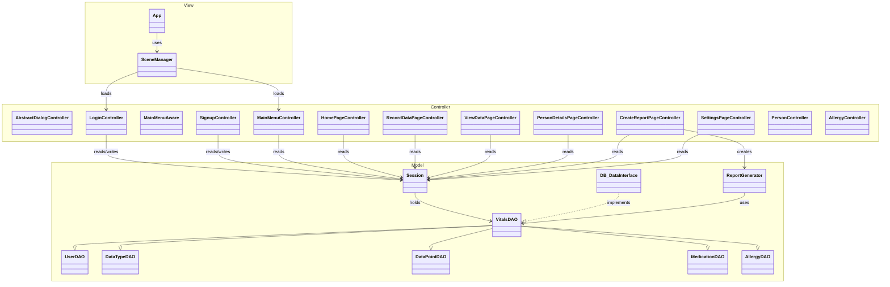
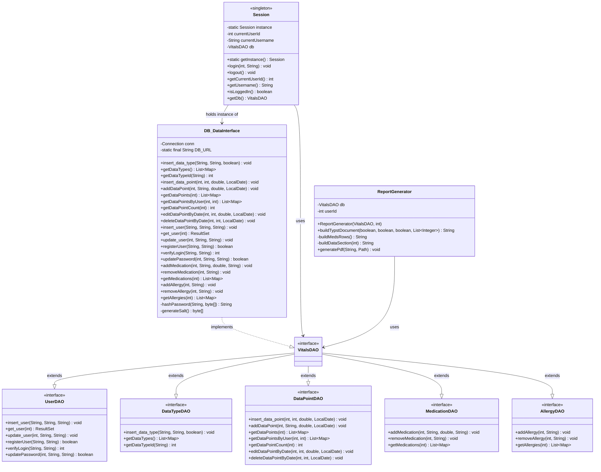
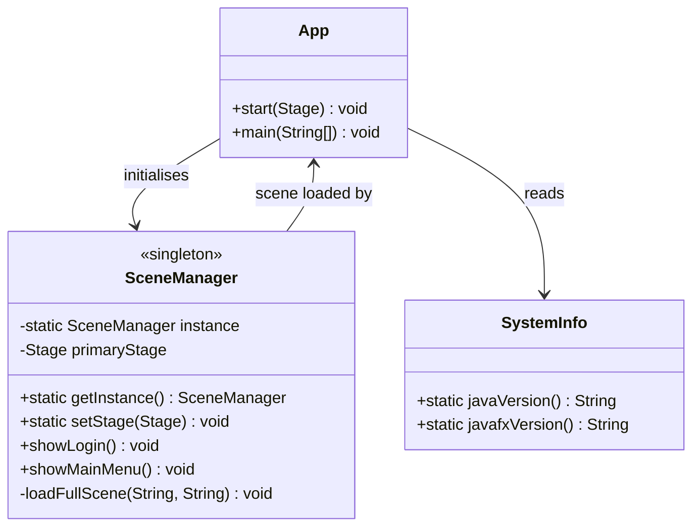

# MyVitals — Class Diagrams

## 1. Overall Architecture (MVC Layers)

```mermaid
classDiagram
    direction TB

    namespace View {
        class App
        class SceneManager
    }

    namespace Controller {
        class AbstractDialogController
        class MainMenuController
        class MainMenuAware
        class LoginController
        class SignupController
        class HomePageController
        class RecordDataPageController
        class ViewDataPageController
        class PersonDetailsPageController
        class CreateReportPageController
        class SettingsPageController
        class PersonController
        class AllergyController
    }

    namespace Model {
        class Session
        class DB_DataInterface
        class VitalsDAO
        class UserDAO
        class DataTypeDAO
        class DataPointDAO
        class MedicationDAO
        class AllergyDAO
        class ReportGenerator
    }

    App --> SceneManager : uses
    SceneManager --> LoginController : loads
    SceneManager --> MainMenuController : loads

    LoginController --> Session : reads/writes
    SignupController --> Session : reads/writes
    MainMenuController --> Session : reads
    HomePageController --> Session : reads
    RecordDataPageController --> Session : reads
    ViewDataPageController --> Session : reads
    PersonDetailsPageController --> Session : reads
    CreateReportPageController --> Session : reads
    SettingsPageController --> Session : reads

    Session --> VitalsDAO : holds
    DB_DataInterface ..|> VitalsDAO : implements

    VitalsDAO --|> UserDAO
    VitalsDAO --|> DataTypeDAO
    VitalsDAO --|> DataPointDAO
    VitalsDAO --|> MedicationDAO
    VitalsDAO --|> AllergyDAO

    CreateReportPageController --> ReportGenerator : creates
    ReportGenerator --> VitalsDAO : uses
```

---

## 2. Controller Hierarchy

```mermaid
classDiagram
    direction TB

    class AbstractDialogController {
        <<abstract>>
        -Runnable onComplete
        +setOnComplete(Runnable) void
        #complete() void
        +handleExit() void
        +handleAction()* void
        +closeWindow()* void
    }

    class AllergyController {
        <<enum>> Mode
        +ADD_ALLERGY
        +REMOVE_ALLERGY
        -TextField AllergyNameTextField
        -ComboBox AllergyComboBox
        -Button AllergyActionButton
        +setMode(Mode, int) void
        +setup() void
        +handleAction() void
        +closeWindow() void
    }

    class PersonController {
        <<enum>> Mode
        +ADD_MEDICATION
        +EDIT_MEDICATION
        +REMOVE_MEDICATION
        -TextField MedicationNameTextBox
        -TextField MedicationDosageTextBox
        -ComboBox MedicationFreqDropDown
        -Button MedicationAddButton
        +setMode(Mode, int) void
        +initialize() void
        +handleAction() void
        -parseDoubleSafe(String) double
        +closeWindow() void
    }

    class MainMenuAware {
        <<interface>>
        +setMainMenuController(MainMenuController) void
    }

    class MainMenuController {
        -BorderPane mainMenuBorderPane
        +showHomePage() void
        +showRecordDataPage() void
        +showViewDataPage() void
        +showPersonDetailsPage() void
        +showCreateReportPage() void
        +showSettingsPage() void
        +logout() void
        -loadCentre(String) void
    }

    class HomePageController {
        -Label HomePageTodaysDate
        -Label HomePageNumberOfDataPointsRecorded
        -StackedBarChart HomePageDataPointsInLastMonthGraph
        +setMainMenuController(MainMenuController) void
        +initialize() void
        -loadChartData() void
        -wireButtons() void
    }

    class RecordDataPageController {
        -ComboBox RecordDataTypeComboBox
        -TextField RecordDataValueTextField
        -TextField RecordDataDateTextField
        -Button RecordDataSubmitButton
        -Label RecordDataStatusLabel
        -VitalsDAO db
        -int userId
        +initialize() void
        +handleSubmit() void
    }

    class ViewDataPageController {
        -VBox chartsContainer
        +initialize() void
    }

    class PersonDetailsPageController {
        -TextField FirstName
        -TextField LastName
        -TextField NHI
        -TextField Gender
        -TextField DOB
        -TextField Age
        -TextField Height
        -TableView medicationsTable
        -TableView allergiesTable
        -VitalsDAO db
        -int userId
        +initialize() void
        -setAllEditable(boolean) void
        -wireEditButton() void
        -saveField(String, String) void
        +refreshMedications() void
        +refreshAllergies() void
        -openMedDialog(PersonController.Mode) void
        -openAllergyDialog(AllergyController.Mode) void
        -parseIntSafe(String) int
        -parseDoubleSafe(String) double
    }

    class CreateReportPageController {
        -Button CreateReportButton
        -Label CreateReportStatusLabel
        -TextArea CreateReportPreviewArea
        -CheckBox cbPersonal
        -CheckBox cbMedications
        -CheckBox cbAllergies
        -VBox dataTypeCheckboxes
        -LinkedHashMap~CheckBox,Integer~ dataTypeSelections
        +initialize() void
        +handleGenerate() void
        -buildTextPreview() String
    }

    class SettingsPageController {
        -PasswordField SettingsCurrentPasswordField
        -PasswordField SettingsNewPasswordField
        -PasswordField SettingsConfirmPasswordField
        -Button SettingsSaveButton
        -Label SettingsStatusLabel
        +handleChangePassword() void
    }

    class LoginController {
        -TextField LoginUsernameTextBox
        -PasswordField LoginPasswordBox
        -Button LoginSignInButton
        -Button LoginSignUpButton
        +handleSignIn() void
        +handleGoToSignupPage() void
    }

    class SignupController {
        -TextField SignUpFullNameTextBox
        -TextField SignUpUsernameTextBox
        -PasswordField SignUpPasswordTextBox
        -Button SignUpSignUpButton
        -Button SignUpSignInButton
        -Button SignUpExitButton
        -Label SignUpErrorLabel
        +handleSignUp() void
        +handleGoToSignIn() void
        +handleExit() void
        -closeWindow() void
    }

    AbstractDialogController <|-- AllergyController : extends
    AbstractDialogController <|-- PersonController : extends

    MainMenuAware <|.. HomePageController : implements
    MainMenuAware <|.. RecordDataPageController : implements
    MainMenuAware <|.. ViewDataPageController : implements
    MainMenuAware <|.. PersonDetailsPageController : implements
    MainMenuAware <|.. CreateReportPageController : implements
    MainMenuAware <|.. SettingsPageController : implements

    MainMenuController --> HomePageController : loads
    MainMenuController --> RecordDataPageController : loads
    MainMenuController --> ViewDataPageController : loads
    MainMenuController --> PersonDetailsPageController : loads
    MainMenuController --> CreateReportPageController : loads
    MainMenuController --> SettingsPageController : loads

    PersonDetailsPageController --> PersonController : opens dialog
    PersonDetailsPageController --> AllergyController : opens dialog
```

---

## 3. Model / DAO Layer

```mermaid
classDiagram
    direction TB

    class VitalsDAO {
        <<interface>>
    }

    class UserDAO {
        <<interface>>
        +insert_user(String, String, String) void
        +get_user(int) ResultSet
        +update_user(int, String, String) void
        +registerUser(String, String) boolean
        +verifyLogin(String, String) int
        +updatePassword(int, String, String) boolean
    }

    class DataTypeDAO {
        <<interface>>
        +insert_data_type(String, String, boolean) void
        +getDataTypes() List~Map~
        +getDataTypeId(String) int
    }

    class DataPointDAO {
        <<interface>>
        +insert_data_point(int, int, double, LocalDate) void
        +addDataPoint(int, String, double, LocalDate) void
        +getDataPoints(int) List~Map~
        +getDataPointsByUser(int, int) List~Map~
        +getDataPointCount(int) int
        +editDataPointByDate(int, int, double, LocalDate) void
        +deleteDataPointByDate(int, int, LocalDate) void
    }

    class MedicationDAO {
        <<interface>>
        +addMedication(int, String, double, String) void
        +removeMedication(int, String) void
        +getMedications(int) List~Map~
    }

    class AllergyDAO {
        <<interface>>
        +addAllergy(int, String) void
        +removeAllergy(int, String) void
        +getAllergies(int) List~Map~
    }

    class DB_DataInterface {
        -Connection conn
        -static final String DB_URL
        +insert_data_type(String, String, boolean) void
        +getDataTypes() List~Map~
        +getDataTypeId(String) int
        +insert_data_point(int, int, double, LocalDate) void
        +addDataPoint(int, String, double, LocalDate) void
        +getDataPoints(int) List~Map~
        +getDataPointsByUser(int, int) List~Map~
        +getDataPointCount(int) int
        +editDataPointByDate(int, int, double, LocalDate) void
        +deleteDataPointByDate(int, int, LocalDate) void
        +insert_user(String, String, String) void
        +get_user(int) ResultSet
        +update_user(int, String, String) void
        +registerUser(String, String) boolean
        +verifyLogin(String, String) int
        +updatePassword(int, String, String) boolean
        +addMedication(int, String, double, String) void
        +removeMedication(int, String) void
        +getMedications(int) List~Map~
        +addAllergy(int, String) void
        +removeAllergy(int, String) void
        +getAllergies(int) List~Map~
        -hashPassword(String, byte[]) String
        -generateSalt() byte[]
    }

    class Session {
        <<singleton>>
        -static Session instance
        -int currentUserId
        -String currentUsername
        -VitalsDAO db
        +static getInstance() Session
        +login(int, String) void
        +logout() void
        +getCurrentUserId() int
        +getUsername() String
        +isLoggedIn() boolean
        +getDb() VitalsDAO
    }

    class ReportGenerator {
        -VitalsDAO db
        -int userId
        +ReportGenerator(VitalsDAO, int)
        +buildTypstDocument(boolean, boolean, boolean, List~Integer~) String
        -buildMedsRows() String
        -buildDataSection(int) String
        +generatePdf(String, Path) void
    }

    VitalsDAO --|> UserDAO : extends
    VitalsDAO --|> DataTypeDAO : extends
    VitalsDAO --|> DataPointDAO : extends
    VitalsDAO --|> MedicationDAO : extends
    VitalsDAO --|> AllergyDAO : extends

    DB_DataInterface ..|> VitalsDAO : implements

    Session --> VitalsDAO : uses
    Session --> DB_DataInterface : holds instance of

    ReportGenerator --> VitalsDAO : uses
```

---

## 4. View Layer

```mermaid
classDiagram
    direction TB

    class App {
        +start(Stage) void
        +main(String[]) void
    }

    class SceneManager {
        <<singleton>>
        -static SceneManager instance
        -Stage primaryStage
        +static getInstance() SceneManager
        +static setStage(Stage) void
        +showLogin() void
        +showMainMenu() void
        -loadFullScene(String, String) void
    }

    class SystemInfo {
        +static javaVersion() String
        +static javafxVersion() String
    }

    App --> SceneManager : initialises
    App --> SystemInfo : reads
    SceneManager --> App : scene loaded by
```
